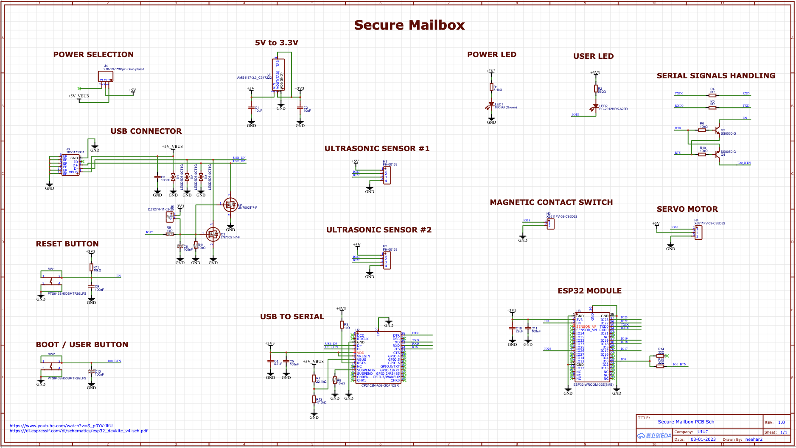

# Neehar Worklog

# 2-8-2023 - Initial CAD & Soldering Assignment

My group has placed me in charge of designing and soldering the PCB. I am a little worried as I do not have too much experience with PCB design. I paid very close attention in the CAD assignment becoming familiar with KiCad and the shortcuts required. The main important things are to choose the right parts, connect the signals correctly, select the footprints, and finally efficiently place parts and route wires/vias. I am gonna begin soldering the PCB for the mini encabulator today. I have some experience with soldering so I believe I can apply those skills today and on our actual PCB.

# 3-7-2023 - Parts Ordering

We have began ordering parts now and understanding which signals will be required for the parts. We have received an ESP32 development board and will begin breadboarding and slowly integrating the ultrasonic sensors, magnetic contact switch, and servo motor. We have found the link below and hope to utilize this resource as it gives examples using all these parts.

[ESP32 Resource](https://esp32io.com/)

# 3-8-2023 - No Development Boards Allowed

I have began planning and designing the schematic for the PCB. I was planning on including female headers to connect all the sensors and female headers to connect the ESP32 development board. However, we just found out we cannot use development boards which will significantly complicate my design of the PCB. The past couple weeks we have been planning on using a development board and this will be a major setback with the first round PCBway orders being today. We will have to figure out another approach by the next round.

# 3-21-2023 - Part Integration

Although we are not allowed to use development boards, we have breadboarded and understood all the parts and signals required. Now we must transfer this wiring to the PCB and place the parts inside the mailbox. Using the development board ensures we can easily use the ESP32 when the PCB arrives and we can begin working on the software portions such as the app development.

# 3-28-2023 - PCB Design

I have been designing the PCB the past week and believe I have almost completed the schematic using the YouTube video below. It has not been too complicated as we are simply added a couple female headers to the development board. Here is the completed schematic:

[PCB Design Resource](https://www.youtube.com/watch?v=S_p0YV-JlfU)

# 2021-03-01 - Parts update

From further discussions about the issue of communicating to both VESCs individually or to a ‘master’ VESC to both, we have decided to go with a pair of single VESCs. For example, we could attach a CANBUS cable between the pair of VESCs in order to allow them to communicate with each other, or simply split two PPM signals to pass throttle information individually, among various other choices. In other words, the VESCs can work in tandem with one another or can be independent from each other.

I have assembled a significant portion of the board at this point, as seen here in this picture below:

Some issues:

- The motor pulley is scraping on the motor mount. This is an issue of tolerances, as the
motor mount I am using is 6mm wide and the Motor shaft has a tolerance of 6.2mm +-
0.5mm. In theory, we should have 0.2mm of space, but the margin of error was not in our
favor.
  
- The threads on the ends of the trucks are not deep enough. We need bearing spacers to
push the wheel out.
  
  
  
