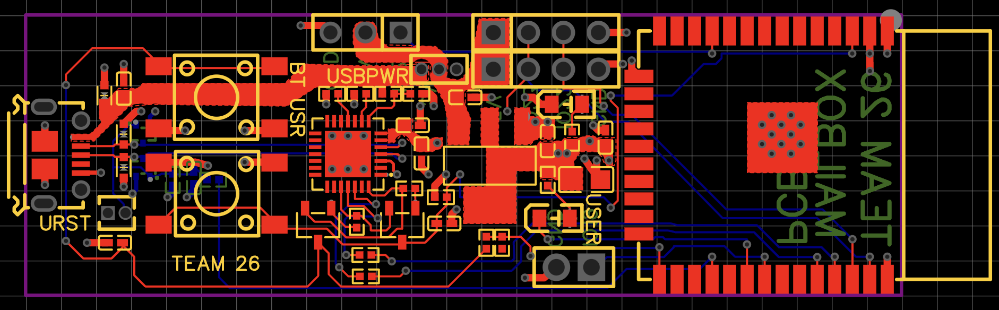
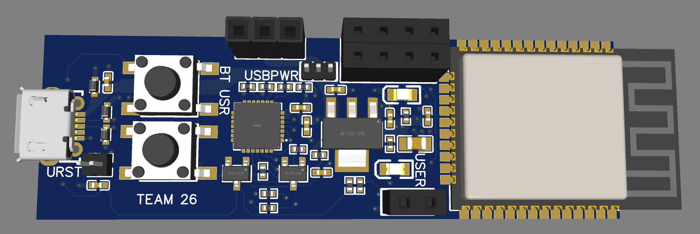

# Neehar Worklog

# 2-8-2023 - Initial CAD & Soldering Assignment

My group has placed me in charge of designing and soldering the PCB. I am a little worried as I do not have too much experience with PCB design. I paid very close attention in the CAD assignment becoming familiar with KiCad and the shortcuts required. The main important things are to choose the right parts, connect the signals correctly, select the footprints, and finally efficiently place parts and route wires/vias. I am gonna begin soldering the PCB for the mini encabulator today. I have some experience with soldering so I believe I can apply those skills today and on our actual PCB.

# 3-7-2023 - Parts Ordering

We have began ordering parts now and understanding which signals will be required for the parts. We have received an ESP32 development board and will begin breadboarding and slowly integrating the ultrasonic sensors, magnetic contact switch, and servo motor. We have found the link below and hope to utilize this resource as it gives examples using all these parts.

[ESP32 Resource](https://esp32io.com/)

# 3-8-2023 - No Development Boards Allowed

I have began planning and designing the schematic for the PCB. I was planning on including female headers to connect all the sensors and female headers to connect the ESP32 development board. However, we just found out we cannot use development boards which will significantly complicate my design of the PCB. The past couple weeks we have been planning on using a development board and this will be a major setback with the first round PCBway orders being today. We will have to figure out another approach by the next round.

# 3-21-2023 - Part Integration

Although we are not allowed to use development boards, we have breadboarded and understood all the parts and signals required. Now we must transfer this wiring to the PCB and place the parts inside the mailbox. Using the development board ensures we can easily use the ESP32 when the PCB arrives and we can begin working on the software portions such as the app development.

# 3-27-2023 - PCB Schematic

I have been designing the PCB the past week and believe I have almost completed the schematic using the YouTube video below. It has not been too complicated as we are simply added a couple female headers to the development board. I have shifted gears from KiCad to to the online EasyEDA editor as that is what the tutorial uses. Here is the completed schematic:

[PCB Design Resource](https://www.youtube.com/watch?v=S_p0YV-JlfU)

# 3-28-2023 - PCB Design

I have continued following the YouTube tutorial to route the wires on the PCB and complete the design. I have added 2 4-pin female headers for the ultrasonic sensors, a 2-pin female header for the magnetic contact switch, and a 3-pin female header for the servo motor to the original ESP32 development board design. I had to be strategic in the placement of the headers to ensure they are easily routable and accessible. I will be attending a design review and meeting with our mentor to ensure our PCB design will not have any problems. Then I will run the audit on the Gerber file. We have began ordering parts for the PCB as well.

# 4-11-2023 - Parts and PCB Arrive

We have received the majority of our parts and our PCB has come as well! Now I will begin soldering the parts onto the PCB as they arrive. The SMD components such as resistors, ESP32, and voltage regulator will be the most difficult. However, I was able to do quite well on the soldering assignment so I hope to be able to solder our PCB well as well. I am hoping the PCB works and I am not required to debug as well as order a new PCB. My plan going forward is to slowly solder the smaller parts first and then the larger components.

  
  
